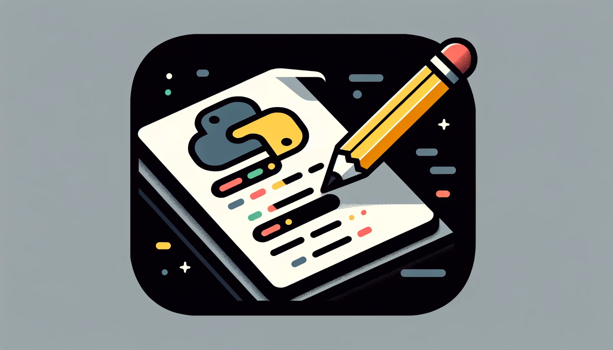
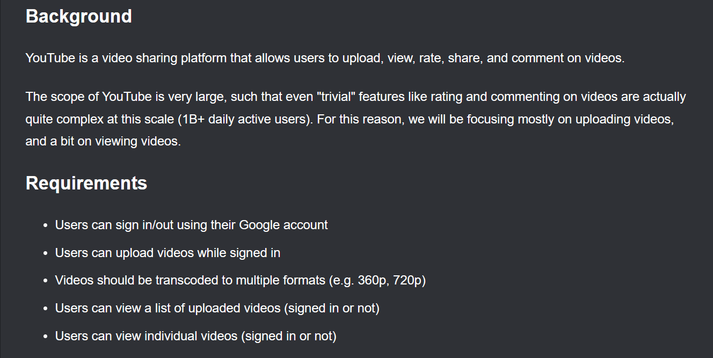
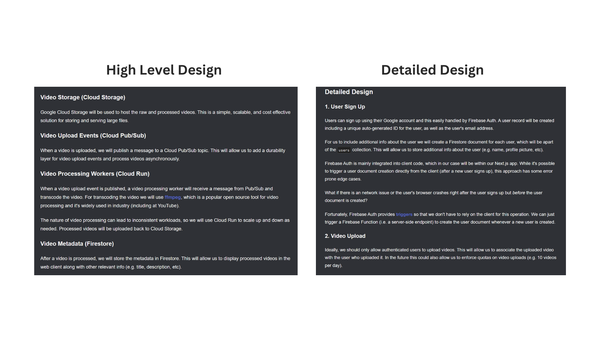

# The Importance of Written Communication as a Software Engineer 

One of the things that is not talked about enough is the importance of written communication as a software engineer. If you can code but struggle to effectively communicate your ideas, it can significantly hold back your career. I learned the value of written communication the hard way, but it made me a better engineer in hindsight.

It's easy to think our documentation is clear when it's explaining our ideas from our perspective. However, documentation should be written to make it easy for readers to grasp complex technical concepts. It can be a little tricky to put together elegant documentation, which is organized and flows well.  

That's why I wanted to make this post to share with you why I think written communication is important, my experiences, and what makes a good design document. 

P.S. This post was inspired by one of the many experiences I had at Google.

## The Impact of Honest feedback

While I was working at Google, my tech lead went out of his way to "roast" me on my poorly written documentation, which was a stinging but invaluable lesson.

It started with a lengthy, 15-page design document I sent for review to one of the smartest engineers I have ever worked with. The document was technically accurate but unorganized and messy. Thirty minutes later, I got pinged by that same engineer and he offered to give me qualitative feedback on my work.

Though I knew he was going to go hard on me, I only found out the shortcomings of my design doc during the meeting. Comparing my design docs to his, the difference was night and day. His design documents were extremely elegant, detailed and concise even though they were about complicated stuff. I am sure if you have ever read bad documentation, you know that it just reads like a wall of text. This was the opposite.

Having someone experienced provide honest feedback is a blessing, as it's easy to overlook flaws in our work when no one points them out. This is one of the reasons why I admired this engineer so much. At Google, people are really nice and they don't want to step on your toes but that can sometimes mean that they won't be honest with you. This engineer, however, cared very deeply and that's why I liked him so much.

I don't want to bore you with too many details, as you might not find them as interesting. Instead, I'll share tips on writing good design documents and how you can improve yours.

## The Art of Writing Effective Design Documents

### Avoiding Assumptions About Reader's Knowledge

I am sure you have come across a technical video where the author assumes some level of knowledge, which leaves you to do your own research trying to understand the ten different fancy terms they mentioned within the first thirty seconds of the video. Writing documentation as a software engineer is very similar. 

When you are writing documentation for a project you are working on, you are in the weeds and naturally you may assume a certain level of knowledge from the reader. But, just because it is obvious to you doesn't mean it is obvious to the reader, especially when you don't know who is going to be reading your documentation.

This is why if you introduce terms or concepts that the reader might be unfamiliar with, it is your responsibility as the author to give the reader some context. This doesn't have to be extensive as nobody wants to spend an hour reading a preamble, but the aim should be to get the reader on the same page. Something along the lines of, "if you are unfamiliar with X, here is a link that explains it well" or even providing a very brief explanation would be appropriate. This gives the person reading your documentation the option to get more familiar with your work, should they choose to do so.

This leads me on to my second tip which is about being concise while still providing detail.

### Balancing Detail with Conciseness

When someone starts reading your design document, they might be completely unfamiliar with the problem. It's important to not bombard the reader with too much detail. Instead, start off with a concise preamble and a high level overview. 

For example, if you are writing documentation for software that uses microservices, the preamble shouldn't go into low level detail on what each microservice comprises of and how it works. I will demonstrate this with an example in a bit.

You might add more detail later on in the document, but understanding the document's goal shouldn't require reading every detail.

The balance between detail and conciseness is also crucial for the future maintainers of the codebase who need to grasp your thought process quickly. They don't need to know the exact details and probably don't have a lot of time.

Unlike a one-time homework assignment, code is an ongoing project. Your documentation should be direct and to the point.

This is a bit harsh, but often people don't care about your work as much as you do. At Google, I was often presenting to directors and I learned that no one is paying as much attention to you as yourself.

In fact, there are times when a reviewer might overlook your work if it's poorly written. In such cases, the responsibility for any documentation shortcomings falls on you.

### Example of Good Written Communication from NeetCode

I don't have examples of documentation I wrote at Google, but my [Design a YouTube Clone](https://neetcode.io/courses/lessons/design-youtube) design doc is a good example, which is also part of the [Full Stack Development](https://neetcode.io/courses/full-stack-dev/).

The document serves as a quick reference and follows the two points mentioned in the section above. Let's go over them briefly.

I have an architecture diagram (shown below) which contains terms specific to the project. You might not know what **Cloud Run** or **Pub/Sub** is when you are glancing at the diagram. Therefore, instead of assuming this knowledge and letting the reader do their own research, I give a high level overview of these terms so the reader doesn't get confused when I use the same terms later on in the design doc.

> If I wanted to take it a step further, I could have also included external links which would provide the reader with the option to explore the terms further, should they choose to do so.

The document also balances detail and conciseness. It starts with an introduction, background and requirements which help the reader understand the scope of the project.

It then goes into more detail in the section called "Detailed Design". Notice that I did not start with the "Detailed Design" because the reader might not care and is simply looking to understand what the design document covers in the first place. 

The image below shows a side by side comparison of the amount of detail I include in my high level and detail design.

## Self-Improvement Through Constructive Criticism

To get better at anything, you need to be receptive to constructive criticism. And while constructive criticism is never easy to digest, I think it helps to be self-critical to a certain degree. 

In my case, every time my tech lead would put up a design document for review, I would read them even though I wasn't the reviewer. I wanted to improve and was willing to put in the work.

## The Unwritten rule

Before I end this post, I do want to mention that written communication is way more important for promotions than people think. As you climb up the ranks, your ability to communicate in writing becomes even more critical because your influence on the team increases.

## Closing Thoughts

Hopefully this post was able to shed some light on the importance of written communication and you were able to learn from my experience.

Getting that honest feedback was a game-changer for me. In the real world, people don't always point out what you're doing wrong. Even with YouTube - if I make a LeetCode video and it doesn't do well, people don't always leave a comment. 

At the end of the day, it is your job to be proactive and find ways to get better.